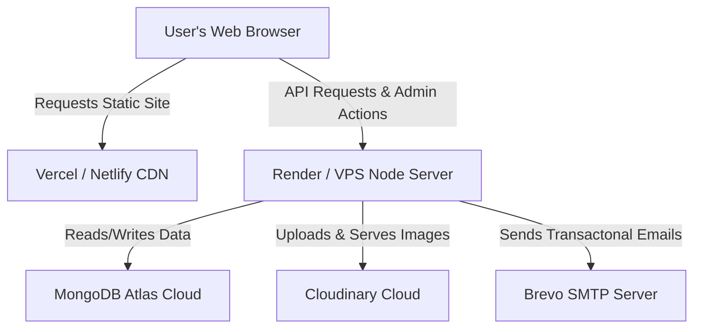

# 🚀 Bridl360 Production Deployment Guide

Welcome to the production deployment guide for **Bridl360**! This document provides complete, step-by-step blueprints for launching the website live on the internet. 

Since Bridl360 is built using a modern **decoupled MERN architecture**, we can deploy it using two highly effective strategies:
* **Strategy A (Easiest & Free/Low Cost):** Serverless architecture using **Vercel/Netlify** for the frontend and **Render/Railway** for the backend Node.js API.
* **Strategy B (Premium & Highly Performant):** Single Virtual Private Server (VPS) on **DigitalOcean / Hostinger / AWS** hosting both frontend and backend under Nginx with PM2.

---

## 🏗️ Architecture Overview

Before deploying, let's look at how the pieces connect:



* **Frontend:** Built with React, Vite, and Tailwind CSS. Compiles to static files (`index.html`, CSS, JS) which can be hosted on a global Edge CDN for near-instant load speeds.
* **Backend:** Node.js + Express API server that handles business logic, auth, settings, leads, and agents.
* **Database:** MongoDB Atlas. **Good News:** Your database is already cloud-hosted! We just need to ensure the IP whitelist is configured so the production server can access it.
* **Media Asset Manager:** Cloudinary. Automatically hosts and resizes image uploads.
* **SMTP Server:** Brevo. Handles system email dispatches (auth, welcome, notifications).

---

## ⚡ Strategy A: Serverless & Decoupled (Recommended for Quick Launch)

This is the most popular, modern way to deploy React + Node.js apps. It utilizes specialized platforms for static frontends and backend servers.

### Part 1: Prepare MongoDB Atlas (Crucial)
Because serverless providers (like Render or Vercel) rotate server IPs dynamically, you must allow Atlas to accept connections from your deployment servers.
1. Sign in to your [MongoDB Atlas Dashboard](https://cloud.mongodb.com/).
2. In the left-hand navigation, under **Security**, click **Network Access**.
3. Click **Add IP Address**.
4. Choose **Allow Access From Anywhere** (enters `0.0.0.0/0`).
   > [!NOTE]
   > This is highly secure as long as your `MONGO_URI` contains a strong password. Atlas uses credential-based authentication.
5. Click **Confirm**.

---

### Part 2: Deploy the Backend API (Render.com)
Render is an exceptional platform for hosting Node.js applications.

1. Sign up/log in to [Render](https://render.com/).
2. Click **New +** and select **Web Service**.
3. Connect your GitHub/GitLab repository.
4. Set the following configuration options:
   * **Name:** `bridl360-backend`
   * **Region:** Choose the region closest to your target audience.
   * **Branch:** `main` (or whichever branch holds your production code).
   * **Root Directory:** `backend`
   * **Runtime:** `Node`
   * **Build Command:** `npm install`
   * **Start Command:** `npm start`
   * **Instance Type:** **Free** (or Starter/Individual for no cold starts).
5. Open the **Environment** tab on Render and add your environment variables:

| Key | Value | Notes |
| :--- | :--- | :--- |
| `NODE_ENV` | `production` | Enables production optimizations |
| `PORT` | `10000` (Render binds automatically) | Port backend will run on |
| `MONGO_URI` | *Your Atlas connection string* | Copy from your local `.env` |
| `JWT_SECRET` | *A random long string* | Keep it secret |
| `JWT_EXPIRES_IN` | `7d` | |
| `EMAIL_HOST` | `smtp-relay.brevo.com` | |
| `EMAIL_PORT` | `587` | |
| `EMAIL_USER` | *Your Brevo SMTP Login* | |
| `EMAIL_PASS` | *Your Brevo SMTP Password/Key* | |

6. Click **Deploy Web Service**.
7. Once deployed, Render will provide a public URL like `https://bridl360-backend.onrender.com`. **Copy this URL!**

---

### Part 3: Deploy the Frontend (Vercel)
Vercel is the creator of Next.js and has the fastest, most reliable edge network for Vite apps.

1. Sign up/log in to [Vercel](https://vercel.com/).
2. Click **Add New** > **Project**.
3. Import your GitHub repository.
4. In the configuration panel:
   * **Framework Preset:** `Vite` (Vercel automatically detects this).
   * **Root Directory:** `frontend`
   * **Build and Output Settings:** Leave defaults (Build command: `vite build`, Output directory: `dist`).
5. Expand **Environment Variables** and add:
   * **Key:** `VITE_API_URL`
   * **Value:** `https://bridl360-backend.onrender.com/api` *(Your Render backend URL + `/api`)*
6. Click **Deploy**.
7. Vercel will build the frontend and provide a stunning domain (e.g., `https://bridl360.vercel.app`), which you can later point to a custom domain (e.g., `https://bridl360.com`) with a single click.

---

## 🛡️ Strategy B: High-Performance VPS (Best for Premium Brands)

Deploying to a Virtual Private Server (VPS) like DigitalOcean, Hostinger VPS, or AWS EC2 is ideal for premium real estate platforms. It eliminates all "cold starts" (where the free server falls asleep) and offers superior loading times.

### Server Requirements
* **OS:** Ubuntu 22.04 LTS or 24.04 LTS
* **RAM:** 1 GB minimum (2 GB recommended)
* **Storage:** 20 GB SSD

### Step 1: Install Node.js, Nginx, and PM2
SSH into your VPS and install core system utilities:
```bash
# Update packages
sudo apt update && sudo apt upgrade -y

# Install Node.js (Version 20)
curl -fsSL https://deb.nodesource.com/setup_20.x | sudo -E bash -
sudo apt-get install -y nodejs

# Install PM2 globally (Process Manager to keep backend running forever)
sudo npm install pm2 -g

# Install Nginx (Web server and Reverse Proxy)
sudo apt install nginx -y
```

### Step 2: Configure the Backend Node.js App
1. Clone your project in `/var/www/bridl360`:
   ```bash
   sudo mkdir -p /var/www/bridl360
   sudo chown -R $USER:$USER /var/www/bridl360
   git clone <your-git-repo-url> /var/www/bridl360
   ```
2. Navigate to the backend, install dependencies, and create the `.env` file:
   ```bash
   cd /var/www/bridl360/backend
   npm install --production
   nano .env
   ```
   Paste all production environment variables (MongoDB URI, JWT Secret, Brevo configuration, etc.) and save.
3. Start the backend process using PM2:
   ```bash
   pm2 start server.js --name "bridl360-backend"
   pm2 save
   pm2 startup
   ```

### Step 3: Build the Frontend Static Assets
1. Navigate to the frontend directory, configure the environment variable, and build:
   ```bash
   cd /var/www/bridl360/frontend
   npm install
   
   # Create production env file
   echo "VITE_API_URL=https://bridl360.com/api" > .env.production
   
   # Compile React code down to optimized JS/CSS
   npm run build
   ```
   This generates all compiled static files inside `/var/www/bridl360/frontend/dist`.

### Step 4: Configure Nginx Reverse Proxy
Nginx will host the static frontend on port `80` (HTTP) and dynamically proxy all `/api` requests straight to your Node.js backend running on port `5000`.

1. Open a new Nginx server configuration:
   ```bash
   sudo nano /etc/nginx/sites-available/bridl360
   ```
2. Paste the following configuration (replace `bridl360.com` with your actual domain or VPS IP):
   ```nginx
   server {
       listen 80;
       server_name bridl360.com www.bridl360.com;

       # Serve React Static Frontend
       location / {
           root /var/www/bridl360/frontend/dist;
           index index.html;
           try_files $uri $uri/ /index.html;
       }

       # Proxy API requests to Node.js backend
       location /api/ {
           proxy_pass http://localhost:5000;
           proxy_http_version 1.1;
           proxy_set_header Upgrade $http_upgrade;
           proxy_set_header Connection 'upgrade';
           proxy_set_header Host $host;
           proxy_cache_bypass $http_upgrade;
       }
   }
   ```
3. Enable the site and restart Nginx:
   ```bash
   sudo ln -s /etc/nginx/sites-available/bridl360 /etc/nginx/sites-enabled/
   sudo rm /etc/nginx/sites-enabled/default # Remove default Nginx welcome page
   sudo nginx -t # Validate config syntax
   sudo systemctl restart nginx
   ```

### Step 5: Install SSL (HTTPS)
SSL is mandatory for security, JWT token handling, and premium SEO ranking. Install Certbot to generate a free, auto-renewing Let's Encrypt SSL certificate:
```bash
sudo apt install snapd
sudo snap install core; sudo snap refresh core
sudo snap install --classic certbot
sudo ln -s /snap/bin/certbot /usr/bin/certbot

# Request & automatically install the SSL cert on Nginx
sudo certbot --nginx -d bridl360.com -d www.bridl360.com
```

---

## 🏁 Post-Deployment Verification Checklist

Once your deploy completes, verify the application's health:
1. **Database Health check:** Navigate to `<Your-App-URL>/api/db-status` in your browser. It should return `{"connected": true}`.
2. **First Administrator Boot:** Run `node create-dev-user.js` in your backend directory on production to initialize the admin credentials, or transfer your local MongoDB collections.
3. **Logins & Authentication:** Verify that logging in works and returns correct tokens.
4. **Leads Dispatch:** Go to the contact page, submit a lead, and verify it appears instantly inside the Admin Leads panel.

***

*Congratulations! Your premium real estate system is officially ready to take over the market.* 🌟
